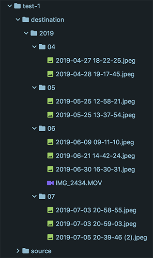

# Image Move

Move images from a source folder to a destination folder.
The destination folder will organize the images by 
created date in the ExifTags.

Run image-move with:

```
python ./image-move/src/sync.py -s /images/test-1/source -d /images/test-1/destination
```

The final destination directory structure will look like:

